# Recovered Antigravity SOTA Speed/Accuracy Plan

Recovered on 2026-05-23 from `transcript - Copy.jsonl`.

Important recovery note: the stored transcript already contains literal truncation markers inside the saved `VIEW_FILE` and `write_to_file` payloads. This file preserves the exact recoverable plan text and explicitly marks unrecoverable gaps instead of inventing missing content.

---

## Exact Recovered Plan Text

# SOTA Speed and Accuracy Architectural Optimization Plan for AI Negotiation Copilot

This document provides a highly detailed, production-grade architectural optimization blueprint for the **AI Negotiation Copilot**. It incorporates the design decisions confirmed during the interactive session to achieve **sub-100ms processing and UI latency** and **100% transcription and AI decision accuracy**.

---

## Executive Summary & Target Latency Profile

To make the negotiation advisor feel entirely natural, lag-free, and precise during real-time discussions, the system must achieve two target limits:
1. **Private Ask-AI voice response:** Sub-250ms round-trip latency (from releasing the hold-orb to the first audio packet playing in the user's earphone).
2. **Background listener extraction:** Sub-1.0s processing-to-strategic-grounding latency (transcribing background speech, running context extraction, and updating the dynamic advisor sheet).

```mermaid
gantt
    title Latency Budget Optimization (Current vs. SOTA Optimized)
    dateFormat  X
    axisFormat %s

    section Current Pipeline (1.2s - 2.5s)
    Main-thread capturing & division resampling (150ms)   :active, 0, 150
    FastAPI WebSocket proxy buffering (150ms-300ms)        :active, 150, 450
    Remote STT & Gemini Live RTT (600ms-1.2s)              :active, 450, 1250
    AI response generation & UI rendering (400ms-800ms)    :active, 1250, 2000

    section Optimized SOTA Pipeline (150ms - 280ms)
    Worklet capture & drift-free resampling (20ms)         :done, 0, 20
    TCP_NODELAY direct streaming transit (30ms)            :done, 20, 50
    Optimized Gemini Live audio turn (150ms)               :done, 50, 200
    Client-side WebRTC VAD instant playback (50ms)         :done, 200, 250
```

---

## User-Approved Architectural Decisions

The following direct choices have been locked in by the user and form the core framework of this optimization plan:

1. **Drift-Free Audio Resampling:** Migrate `overlay.js` downsa

[Recovery gap: the transcript truncates the plan body here. The middle portion between this line and the later recovered sections was not preserved verbatim in the stored transcript.]

### 2. Manual Verification & QA

1. **Pitch Shift Validation:** Capture audio using a 44.1kHz native microphone device. Replay the captured buffer and verify that the pitch matches the speaker's natural voice, confirming the drift-free Bresenham phase resampler is functioning.
2. **Barge-In Usability Check:** Speak over the AI mid-sentence and verify that the local AudioWorklet immediately clears playback buffers, instantly stopping output speaker audio in <50ms.
3. **Sentence Integrity Test:** Speak a long, complex paragraph with brief pauses. Verify in the session log that the entire text is fully assembled and pushed into the Listener Agent without any missing middle phrases.

[Recovery gap: later plan sections 3 and early section 4 body were not fully preserved verbatim in the stored transcript.]

* **ASGI Server Optimization:** We explicitly run Uvicorn with `uvloop` (enabled by default on Linux/Unix systems) to maximize network performance and WebSocket event-loop processing speed.

### 4. Deepgram Segment Assembly & Context Extraction

* **Segment Buffer State Machine:**
    Deepgram emits finalized words/phrases inside `is_final=True` messages, but only sets `speech_final=True` when it detects an actual natural pause.
    To ensure 100% transcript completeness and prevent the "Dropped Middle Speech" bug:
    1. We maintain a rolling dictionary `session.dg_transcript_buffers[source] = []`.
    2. For every message where `is_final` is True, we append the segment text to the buffer.
    3. Only when `speech_final` is True, we join the buffer (`" ".join(...)`), push it to the `listener_agent.py` as a single, grammatically complete sentence, and clear the buffer.
    This guarantees that the strategic negotiator receives complete context for every turn, eliminating advice hallucinations caused by fragmented input.

### 5. 2026 SOTA Web Search Enhancements: Parallelism & UDP/WebRTC Foundations

* **Buffer Size Auto-Tuning:** Dynamic sizing of client audio packets based on real-time network jitter. We will implement a network-aware buffering strategy in the `AudioWorklet`: flushing small 50ms packets on low-latency local connections (to minimize RTT), and scaling up to 150ms packets if network socket queues experience high jitter. This prevents audio dropouts without adding latency for stable connections.
* **Speech-to-Intent Pipeline Parallelism:** Rather than holding context updates in serial, we will stream intermediate finalized transcripts (`is_final=True`) to the Gemini Live background agent context buffer progressively. This allows Gemini Pro to begin parsing intent and context grounding *before* the speaker even completes their full sentence, effectively masking system processing latency.
* **WebRTC UDP Transition Path:** WebSockets rely on TCP, which incurs Head-of-Line blocking and packet retransmission delays on lossy networks. For production environments, the ultimate latency reduction technique is migrating from TCP WebSockets to a **WebRTC UDP-based MediaStream** connection. This eliminates TCP congestion window delays, saving up to 100ms in highly interactive scenarios.

---

## Open Clarifying Questions (No Assumptions)

Before we proceed to the execution phase, we require your feedback on the following questions:

> [!IMPORTANT]
> **Question 1: Primary Microphone Sample Rate**
> What is the native sample rate of your primary audio capture device (e.g. 44.1kHz or 48kHz)? Knowing this will help us verify the exact resampling factor and confirm the presence of the integer pitch-shift distortion on your hardware.

> [!IMPORTANT]
> **Question 2: VB-CABLE Virtual Driver Setup**
> Are you using VB-CABLE with default Windows sample rate configurations (which default to 44.1kHz), or have you manually configured them to 48kHz in the Windows Sound Control Panel? This will determine if the remote loopback track (`remote_app`) also suffers from sample-rate mismatch.

> [!IMPORTANT]
> **Question 3: GCP/Vertex AI Server Region**
> Which GCP region is your Vertex AI instance currently deployed in, and where are you physically located? Deploying in the closest geographical region (e.g. `asia-south1` for India, `us-central1` for the USA, or `europe-west3` for Europe) can save 100-150ms of raw round-trip network latency.

> [!IMPORTANT]
> **Question 4: Deepgram Endpointing Time**
> What is your preferred endpointing silence threshold for the background listener? Currently, it is set to `endpointing_ms = 150` for ultra-fast turn detection, but a larger value (like 300ms) could improve sentence formatting accuracy if the speaker pauses frequently.

---

## Additional Recovered Summary

The transcript also preserved this later summary of key bottlenecks and solutions from Antigravity's final planner response:

* **The Main Thread Capture Lag:** `overlay.js` was described as capturing mic and speaker audio using legacy `ScriptProcessorNode` on Electron's main UI thread. Proposed solution: migrate capture and resampling to a low-latency `AudioWorkletProcessor`.
* **Network Transit Buffering (Nagle's Algorithm):** FastAPI Starlette WebSockets were described as adding packet transit latency. Proposed solution: set `TCP_NODELAY` in `websocket.py`.
* **Ignored Barge-In Playback Bug:** The desktop client `overlay.js` was described as ignoring backend `AUDIO_INTERRUPTED`. Proposed solution: an active playback source registry that immediately stops playing `AudioBufferSourceNode` instances.
* **Dropped Middle Speech / Transcript Fragmentation:** Finalized Deepgram segments were described as being lost before `speech_final=True`. Proposed solution: a session-level transcript segment assembler in `companion_runtime.py`.
* **Zero-Overhead Speaker Separation:** Hardware isolation between `local_mic` and `remote_app` was treated as the preferred architecture for perfect speaker separation without local diarization overhead.
